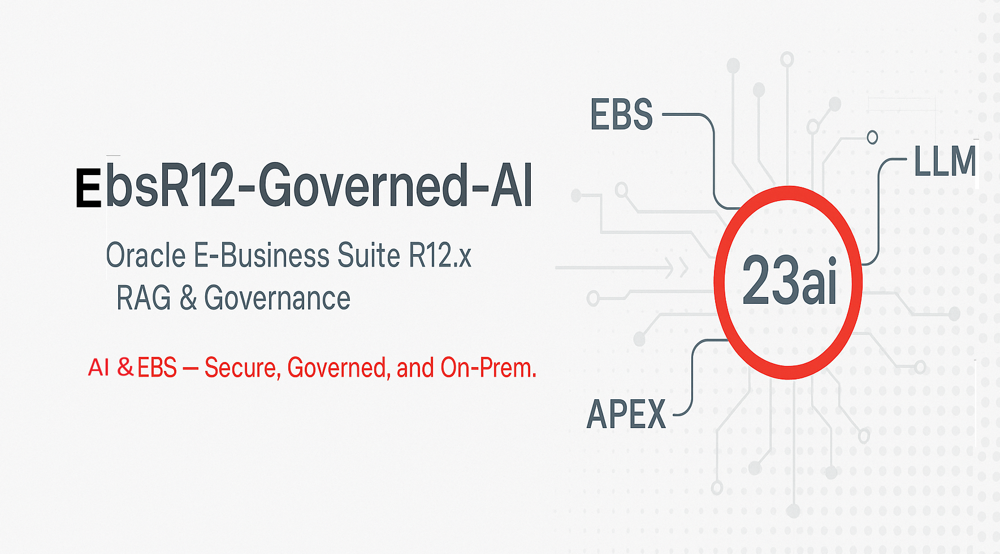

# 🧠 Oracle-ebsR12-Governed-AI — Enterprise RAG Architecture

 

---

## 🏢 Overview

This blueprint defines the **enterprise and solution architecture** for augmenting Oracle E-Business Suite (EBS) R12.x with **Retrieval-Augmented Generation (RAG)** capabilities using **Oracle APEX 23ai**, **Oracle Database 23ai**, and an **on-prem or private LLM gateway**.

It provides a secure, policy-driven design that enables **AI assistance for HRMS, Finance, SCM, and CRM** modules—while preserving existing EBS governance, ICX-session security, and compliance controls.

---

## 🎯 Objectives

| Objective                                  | Outcome                                        |
| ------------------------------------------ | ---------------------------------------------- |
| Augment EBS with AI search & summarization | Natural-language Q&A directly inside EBS       |
| Maintain governance & compliance           | Redaction, audit, and policy-based data access |
| Keep data on-prem                          | Zero data movement beyond Oracle DB            |
| Enable multilingual AI                     | Arabic + English via ONNX E5 Multilingual      |
| Support modular scalability                | Shared RAG engine for all EBS modules          |

---

## 🧩 Architectural Layers

### 1️⃣ **Application Layer**

- **EBS R12.x**: HRMS, FIN, SCM, CRM modules

- **APEX 23ai**: AI workspace, dashboards, and chat UI

- **ORDS**: REST bridge between APEX ↔ LLM

### 2️⃣ **Data Layer**

- **EBS DB**: Source data & attachments (FND_LOBS)

- **23ai DB**: RAG schema with vector indexes, audit, and policy tables

- **Vector Search**: `DBMS_VECTOR` for embedding similarity

### 3️⃣ **Integration Layer**

- ICX session sharing via `ebs_session_util`

- Controlled DB link for attachment ingestion

- LLM callouts via REST (`UTL_HTTP`)

### 4️⃣ **Governance Layer**

- Policy: `CFG_AI_POLICY`

- Redaction: `CFG_REDACTION_RULE` + `AI_POLICY_UTIL`

- Audit: `AI_USAGE_LOG` + APEX dashboard

- Compliance: ISO-style traceability

---

## 🔗 Data & Process Flow

`flowchart LR A[EBS User] -->|Launch from Toolbar| B(APEX App) B -->|ICX Session| C[ebs_session_util] C -->|Context| D[RAG Engine (23ai)] D -->|Retrieve + Redact| E[LLM Gateway] E -->|Summarized Response| F[APEX UI] F -->|Audit| G[AI_USAGE_LOG]`

---

## ⚙️ Core Components

| Component           | Key Package / Feature                 | Purpose                                       |
| ------------------- | ------------------------------------- | --------------------------------------------- |
| **RAG Engine**      | `rag_engine_pkg`                      | Extraction → Chunking → Embedding → Retrieval |
| **Governance**      | `ai_policy_util`, `CFG_AI_POLICY`     | Access control, redaction, compliance         |
| **Audit & Logs**    | `AI_USAGE_LOG`, `AI_REALTIME_USAGE_V` | Transparency & traceability                   |
| **Session Linkage** | `ebs_session_util`                    | Share ICX token between EBS ↔ APEX            |
| **Embedding Model** | ONNX E5 Multilingual                  | Cross-lingual embeddings for Arabic/English   |

---

## 🔐 Governance Highlights

| Policy Area             | Mechanism                    | Description                                   |
| ----------------------- | ---------------------------- | --------------------------------------------- |
| **Authentication**      | ICX session validation       | Only logged EBS users access APEX             |
| **Authorization**       | Responsibility ↔ AI role map | Role-based access per module                  |
| **Data Classification** | `LKP_CLASSIFICATION_LEVEL`   | Public / Internal / Confidential / Restricted |
| **Redaction**           | Regex rules                  | Automatic masking of PII & financial data     |
| **Audit**               | Insert trigger + dashboard   | Every LLM call logged + explainable context   |

---

## 💾 Deployment Topology

| Tier           | Components                              | Description                           |
| -------------- | --------------------------------------- | ------------------------------------- |
| **App Tier 1** | EBS Forms / OACORE                      | User operations & toolbar integration |
| **App Tier 2** | ORDS + APEX (23ai)                      | RAG UI & engine                       |
| **Data Tier**  | Oracle 23ai DB                          | Vectors, audit, governance            |
| **AI Tier**    | On-prem LLM node / OCI Private endpoint | Contextual response generation        |

---

## 🚀 Scalability & Performance

- Horizontal scale: ORDS/APEX load balancing

- Vector index tuning (`HNSW` or `IVF_FLAT`)

- Async processing via DBMS_SCHEDULER

- Context cache in `AI_RESPONSE_CACHE`

---

## 🧮 Module-Specific Use Cases

| Module | Example Use Case                                        | Benefit                      |
| ------ | ------------------------------------------------------- | ---------------------------- |
| HRMS   | “Summarize pending vacation requests for employee Ali.” | Faster HR decision-making    |
| FIN    | “Show overdue invoices > 90 days.”                      | Improved cashflow visibility |
| SCM    | “Top suppliers with delay > 5 days.”                    | Supply risk insight          |
| CRM    | “Summarize customer feedback this quarter.”             | Better customer awareness    |

---

## 📊 Governance Dashboard (APEX)

**Regions:**

- AI Usage Log Grid (`AI_REALTIME_USAGE_V`)

- Policy Violation Stats

- Redacted vs Normal outputs

- Top Queries by User/Module

**KPIs:**

- Avg LLM response time < 4 s

- Redaction accuracy = 100 %

- Policy violations = 0 (Logged & Warned)

---

## 🔄 Implementation Roadmap

| Phase                   | Duration   | Deliverables                         |
| ----------------------- | ---------- | ------------------------------------ |
| **1 – Foundation**      | Month 1    | APEX + 23ai setup, governance tables |
| **2 – Integration POC** | Month 2    | ICX session + RAG engine             |
| **3 – Pilot**           | Month 3    | HR & Finance modules                 |
| **4 – Rollout**         | Month 4-6  | SCM & CRM + Audit dashboard          |
| **5 – Optimization**    | Month 6-12 | LLM tuning + explainability UX       |

---

## 📈 Key Metrics

| KPI                   | Target      |
| --------------------- | ----------- |
| Search time reduction | > 60 %      |
| Avg response latency  | < 4 s       |
| User adoption (pilot) | ≥ 75 %      |
| ROI break-even        | ≤ 36 months |

---

## 👤 Prepared By

**Alaaeldin Abdelmonem**  
*AI Product Manager & Oracle Solutions Architect*
